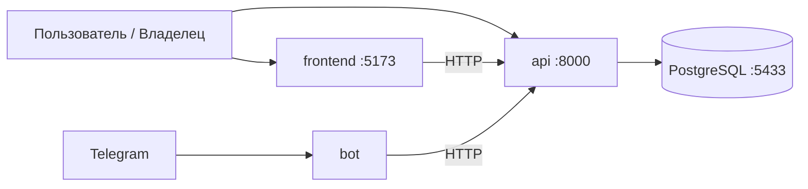

# Anonymous Verified Reviews System
> Система для сбора анонимной и верифицированной обратной связи с контролируемым доступом владельца к отзывам.
## 📖 О проекте
**Anonymous Verified Reviews System** — это сервис для безопасного сбора анонимных отзывов, предложений и обратной связи.
Основная цель проекта — обеспечить баланс между:
- анонимностью отправителя;
- контролируемым доступом владельца к данным;
- прозрачностью взаимодействия;
- защитой от спама и злоупотреблений.
Пользователь может оставить отзыв без регистрации и раскрытия личности, а владелец получает доступ к сообщениям только через специальный токен доступа.
---
## ✨ Основные возможности
### Для пользователей
- Анонимная отправка отзывов
- Простая форма обратной связи
- Отсутствие необходимости регистрации
- Быстрая отправка сообщений
### Для владельцев
- Просмотр всех отзывов через защищённый токен
- Ответы на отзывы
- Управление обратной связью
- Изолированные «ящики отзывов»
### Безопасность
- Ограничение частоты запросов (Rate Limiting)
- Валидация входящих данных
- Фильтрация нежелательного контента
- Токенизированный доступ к данным
- Минимизация хранения пользовательских данных
---
# 🏗 Архитектура

Система состоит из четырёх сервисов: веб-интерфейс, REST API, Telegram-бот и PostgreSQL.

### Компоненты и порты

| Компонент | Технология | Порт (хост) | Назначение |
|-----------|------------|-------------|------------|
| `frontend` | React, Vite | `5173` | UI для пользователей и владельцев |
| `api` | FastAPI, Uvicorn | `8000` | REST API, Swagger (`/docs`) |
| `bot` | Python, aiogram | — | Telegram-интеграция |
| `db` | PostgreSQL 15 | `5433` | Хранение отзывов и пользователей |

### Схема взаимодействия



Поток данных:
- **Пользователь** отправляет отзыв через фронтенд или напрямую в API (`POST /box/{uuid}/feedback`).
- **Владелец** читает отзывы и отвечает, передавая `owner_token` в query или заголовке `X-Owner-Token`.
- **Бот** обращается к API по `API_BASE_URL` (в Docker — `http://api:8000`, локально — `http://localhost:8000`).

### Слои бэкенда (`src/`)

```text
HTTP-запрос → routers → services → models / DB
                    ↘ middlewares (auth, rate limit)
```

---
# 📦 Основные сущности
## Box
Контейнер для хранения отзывов.
Каждый Box имеет:
- уникальный UUID;
- owner token;
- набор связанных отзывов.
## Feedback
Анонимное сообщение пользователя.
Содержит:
- текст сообщения;
- дату создания;
- связь с Box.
## Reply
Ответ владельца на отзыв.
Позволяет выстраивать обратную коммуникацию без раскрытия личности отправителя.
---
# 🗄 Структура данных
Схема базы данных:
<https://dbdiagram.io/d/69fa66b654a51d93d39c2be2>
Основные связи:
```text
Box
 ├── Feedback
 │     └── Reply
```
---
# 🛠 Технологический стек
## Backend
- Python
- FastAPI
- Pydantic
- Uvicorn
## Frontend
- Node.js
- JavaScript / TypeScript
- Vite
## Infrastructure
- Docker
- Docker Compose
## API
- OpenAPI / Swagger
- ReDoc
---
# 📁 Структура репозитория

```text
.
├── src/                    # FastAPI-бэкенд
│   ├── routers/            # HTTP-эндпоинты (box, feedback, auth)
│   ├── services/           # бизнес-логика
│   ├── models/             # SQLAlchemy-модели
│   ├── schemas/            # Pydantic-схемы запросов/ответов
│   ├── middlewares/        # авторизация, rate limiting
│   ├── db/                 # подключение к PostgreSQL
│   ├── core/               # загрузка .env, конфигурация
│   ├── utils/              # валидация, безопасность
│   └── main.py             # точка входа API
│
├── bot/                    # Telegram-бот (запуск: python -m bot.main)
├── frontend/               # React + Vite (+ Electron)
│   ├── src/                # компоненты и экраны
│   └── .env.example        # VITE_API_BASE_URL для фронтенда
│
├── db/                     # schema.sql, seed.sql, миграции
├── api/                    # openapi.yaml — спецификация API
├── docs/                   # DEPLOYMENT.md, TELEGRAM.md
├── tests/                  # pytest-тесты бэкенда
│
├── docker-compose.yml      # оркестрация всех сервисов
├── Dockerfile              # образ API и бота
├── .env.example            # шаблон переменных окружения (корень)
└── README.md
```

---
# 🚀 Быстрый старт

## Требования

| Сценарий | Необходимо |
|----------|------------|
| Docker (рекомендуется) | Docker Desktop, Docker Compose v2 |
| Локальный запуск | Python 3.11+, Node.js 18+, Docker (только для PostgreSQL) |

## 1. Клонирование репозитория

```bash
git clone https://github.com/Kotbuz/Isfcavr-fork-by-kotbuz.git
cd Isfcavr-fork-by-kotbuz
```

## 2. Настройка переменных окружения

Скопируйте шаблон в корне проекта:

```bash
# Linux / macOS
cp .env.example .env

# Windows (PowerShell / cmd)
copy .env.example .env
```

Заполните значения по [матрице переменных](#-переменные-окружения). Минимум для запуска API и БД:

```env
DB_HOST=localhost
DB_PORT=5433
DB_NAME=reviews_db
DB_USER=admin_user
DB_PASSWORD=YOUR_STRONG_PASSWORD
API_BASE_URL=http://localhost:8000
```

Для Telegram-бота дополнительно укажите `TELEGRAM_BOT_TOKEN` (см. [docs/TELEGRAM.md](docs/TELEGRAM.md)).

---
# 🐳 Запуск через Docker Compose (рекомендуется)

Поднимает все сервисы: PostgreSQL, API, бот и фронтенд.

```bash
docker compose up --build
```

Первый запуск может занять несколько минут (сборка образов, инициализация БД из `db/schema.sql`).

### Проверка

| Сервис | URL / команда | Ожидаемый результат |
|--------|---------------|---------------------|
| API health | http://localhost:8000/health | `{"status":"ok"}` |
| Swagger UI | http://localhost:8000/docs | Интерактивная документация |
| Frontend | http://localhost:5173 | Веб-интерфейс |
| PostgreSQL | `localhost:5433` | БД доступна после healthcheck контейнера `db` |

Остановка:

```bash
docker compose down
```

> **Telegram из Docker:** если провайдер блокирует `api.telegram.org`, см. [docs/TELEGRAM.md](docs/TELEGRAM.md).

---
# 💻 Локальный запуск (без полного Docker)

Используйте этот вариант для разработки отдельных компонентов. PostgreSQL удобнее поднять в контейнере, API и фронтенд — на хосте.

### Порядок запуска

```text
1. PostgreSQL (docker compose up db)
      ↓
2. Backend (venv + uvicorn)
      ↓
3. Frontend (npm run dev) — опционально
      ↓
4. Bot (python -m bot.main) — опционально
```

### Шаг 1. База данных

В корневом `.env` укажите подключение к контейнеру на хосте:

```env
DB_HOST=localhost
DB_PORT=5433
```

Запустите только PostgreSQL:

```bash
docker compose up db -d
```

Схема и начальные данные применяются автоматически из `db/schema.sql` и `db/seed.sql`.

### Шаг 2. Backend

```bash
python -m venv .venv
```

Активация виртуального окружения:

```bash
# Windows (PowerShell / cmd)
.venv\Scripts\activate

# Linux / macOS
source .venv/bin/activate
```

Установка и запуск:

```bash
pip install --upgrade pip
pip install -r requirements.txt
uvicorn src.main:app --reload --host 0.0.0.0 --port 8000
```

### Шаг 3. Frontend

```bash
cd frontend
# Linux / macOS: cp .env.example .env
# Windows: copy .env.example .env
npm install
npm run dev
```

Перед `npm run dev` создайте `frontend/.env` из `frontend/.env.example`.

Фронтенд будет доступен на http://localhost:5173 и обращается к API по `VITE_API_BASE_URL` из `frontend/.env`.

### Шаг 4. Telegram-бот (опционально)

Из корня проекта, с активированным `.venv` и заполненным `TELEGRAM_BOT_TOKEN`:

```bash
python -m bot.main
```

В `.env` для локального бота:

```env
API_BASE_URL=http://localhost:8000
```

Подробности привязки и прокси — в [docs/TELEGRAM.md](docs/TELEGRAM.md).

---
# 🔧 Переменные окружения

## Корневой `.env`

Используется API, Docker Compose и ботом. Шаблон: [.env.example](.env.example).

| Переменная | Назначение | Пример (маскированный) | Docker | Локально |
|------------|------------|------------------------|--------|----------|
| `DB_HOST` | Хост PostgreSQL | `localhost` / `db` | `db` (имя сервиса) | `localhost` |
| `DB_PORT` | Порт PostgreSQL | `5433` / `5432` | не задаётся в `.env` (внутри сети `5432`) | `5433` (проброс из compose) |
| `DB_NAME` | Имя базы данных | `reviews_db` | одинаково | одинаково |
| `DB_USER` | Пользователь БД | `admin_user` | одинаково | одинаково |
| `DB_PASSWORD` | Пароль БД | `YOUR_STRONG_PASSWORD` | одинаково | одинаково |
| `DATABASE_URL` | Полная строка подключения | `postgresql://user:pass@db:5432/reviews_db` | задаётся в `docker-compose` для `api` | опционально; иначе собирается из `DB_*` |
| `API_BASE_URL` | URL API для бота | `http://api:8000` / `http://localhost:8000` | `http://api:8000` (внутри сети) | `http://localhost:8000` |
| `PUBLIC_API_BASE_URL` | Публичный URL API (ссылки для пользователя) | `http://localhost:8000` | дефолт в compose | `http://localhost:8000` |
| `TELEGRAM_BOT_TOKEN` | Токен бота от @BotFather | `123456789:AAH...YOUR_TOKEN` | обязателен для сервиса `bot` | обязателен для локального бота |
| `TELEGRAM_BOT_USERNAME` | Username бота без `@` | `my_reviews_bot` | дефолт: `anonymous_verified_reviews_bot` | по желанию |

### Как API подключается к БД

`src/db/database.py` читает `DATABASE_URL` или собирает строку из `DB_USER`, `DB_PASSWORD`, `DB_NAME`, `DB_HOST`, `DB_PORT`. Без этих переменных API не стартует.

## `frontend/.env`

| Переменная | Назначение | Пример |
|------------|------------|--------|
| `VITE_API_BASE_URL` | Базовый URL для HTTP-запросов из браузера | `http://localhost:8000` |

В Docker Compose значение прокидывается из корневого `API_BASE_URL` в `VITE_API_BASE_URL` контейнера `frontend`.

## Дополнительно (Telegram)

Опциональные переменные для прокси и уведомлений описаны в [docs/TELEGRAM.md](docs/TELEGRAM.md).

---
# 🖥 Развёртывание на production

Руководство администратора: требования к серверу, Nginx/Apache, восстановление после сбоев — [docs/DEPLOYMENT.md](docs/DEPLOYMENT.md).

---
# 📚 API Документация
После запуска доступны:
### Swagger UI
```text
http://localhost:8000/docs
```
### ReDoc
```text
http://localhost:8000/redoc
```
---
# 🔌 OpenAPI
Проект использует OpenAPI-спецификацию.
Вы можете импортировать файл:
```text
api/openapi.yaml
```
в:
- Swagger Editor
- Postman
- Insomnia
для тестирования и генерации клиентов.
---
# 📡 API Endpoints
## Отправить отзыв
```http
POST /box/{uuid}/feedback
```
Body:
```json
{
  "text": "Ваш отзыв"
}
```
---
## Получить отзывы владельца
```http
GET /box/{uuid}?token=OWNER_TOKEN
```
или:
```http
X-Owner-Token: OWNER_TOKEN
```
---
## Ответить на отзыв
```http
POST /feedback/{id}/reply?token=OWNER_TOKEN
```
---
# 🔒 Безопасность
## Анонимность
Проект проектируется таким образом, чтобы минимизировать возможность идентификации автора сообщения.
Подходы:
- отсутствие обязательной регистрации;
- отсутствие хранения персональных данных;
- возможность исключить хранение IP-адресов;
- опциональная анонимизация технических метаданных.
## Rate Limiting
Ограничение запросов:
```text
5–10 запросов в минуту на IP
```
Применяется к:
```http
POST /box/{uuid}/feedback
```
## Валидация данных
Ограничения:
- максимальная длина сообщения — 500 символов;
- фильтрация запрещённых слов;
- удаление ссылок через регулярные выражения;
- проверка структуры запросов.
## Авторизация владельца
Доступ к отзывам разрешён только при наличии корректного:
```text
owner_token
```
Все операции чтения и ответа проходят проверку токена.
---
# 🧪 Тестирование
Backend:
```bash
pytest
```
Frontend:
```bash
npm test
```
---
# 📈 Возможные направления развития
- Telegram-уведомления о новых отзывах
- Email-уведомления
- Модерация сообщений
- Реакции на ответы
- Категории отзывов
- Аналитика и статистика
- Dashboard владельца
- JWT-аутентификация
- Поддержка нескольких владельцев
- Экспорт данных
---
# 🤝 Команда
## Team Lead
**Руслан Огнев**
- архитектура системы
- безопасность
- middleware
## Backend/fullstack
**Илья Жабенко**
- проектирование БД
- API
- бизнес-логика
## Frontend
**Александр Брягиня**
- UI/UX
- интеграция с API
## Frontend - bot
**Егор Лесовский**
- bot-разработка
- интеграция компонентов
---
# 🤝 Contributing
1. Fork репозитория
2. Создайте ветку
```bash
git checkout -b feature/new-feature
```
3. Внесите изменения
4. Создайте Pull Request
---
# 📄 License
Проект распространяется под лицензией, указанной в репозитории.
Если лицензия ещё не добавлена, рекомендуется использовать:
```text
MIT License
```
---
# ⭐ Цель проекта
Создать удобную платформу для получения честной и безопасной обратной связи, где пользователь может свободно выражать мнение, а владелец — получать структурированные отзывы без нарушения приватности отправителей.